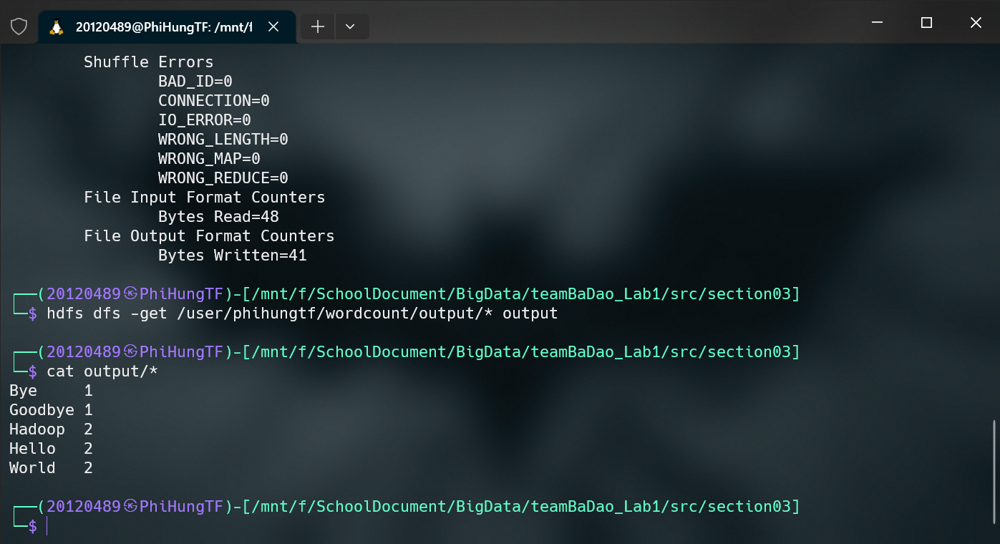
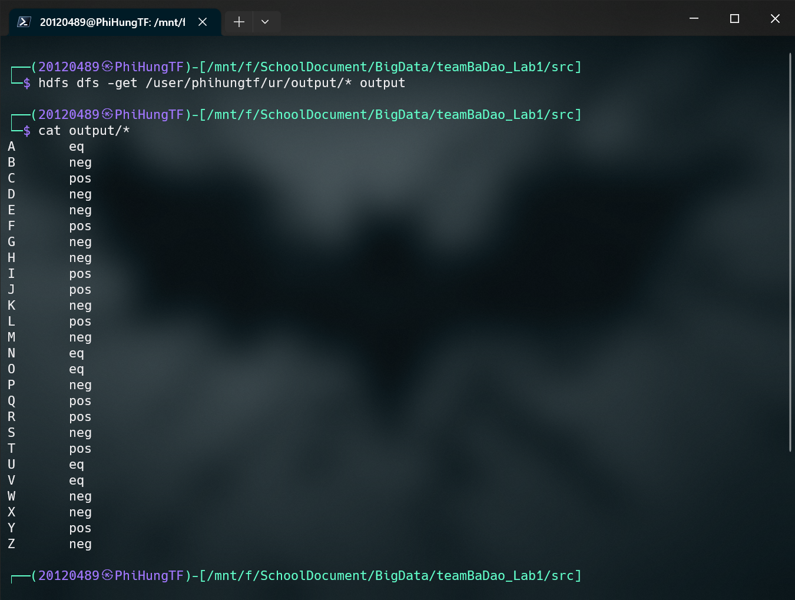

# Lab 01: A Gentle Introduction to Hadoop

## Setting up Single-node Hadoop Cluster

Here are the steps to set up a single-node Hadoop cluster:

### Install Java:

Hadoop is built in Java, so we need to have Java installed on our machine. According to the [Hadoop documentation](https://cwiki.apache.org/confluence/display/HADOOP/Hadoop+Java+Versions), Hadoop requires Java 8 or Java 11.

To install Java 11, open a terminal and run the following command:

```bash
sudo apt-get install openjdk-11-jdk
```


After installing Java, we can verify that it is installed by running the following command:

```bash
java -version
```


### Install `ssh`:

Hadoop uses `ssh` to communicate between nodes in the cluster. To install `ssh`, open a terminal and run the following command:

```bash
sudo apt-get install ssh
```


To verify that ssh is installed, run the following command:

```bash
ssh -V
```


### Download and install Hadoop:

Next, we need to download and install Hadoop. To download Hadoop, open a terminal and run the following command:

```bash
wget https://downloads.apache.org/hadoop/common/stable/hadoop-3.3.4.tar.gz
```


After downloading Hadoop, we need to extract the downloaded file. To do this, run the following command:

```bash
tar -xvzf hadoop-3.3.4.tar.gz
```


### Configure Environment Variables:

First, find the location of our Java installation by running the following command:

```bash
readlink -f $(which java)
```


In our case, the location of our Java installation is `/usr/lib/jvm/java-11-openjdk-amd64`. This is the value we need to set for the `JAVA_HOME` environment variable.

We also need the `HADOOP_HOME` variable to point to the Hadoop installation directory, which is `~/hadoop-3.3.4`, the `PATH` variable to include the `bin` and `sbin` directories of our Hadoop installation, and other Hadoop-related environment variables.

To set these variables, we need to edit the `.bashrc` file. The `.bashrc` file is a shell script that is executed every time you open a new terminal. We can use this file to set environment variables that will be available in all terminals.

Open the `.bashrc` file (by running the command `nano ~/.bashrc`) and add the following line at the end of the file:

```bash
export JAVA_HOME=/usr/lib/jvm/java-11-openjdk-amd64
export HADOOP_HOME=~/hadoop-3.3.4
export PATH=$PATH:$HADOOP_HOME/bin
export PATH=$PATH:$HADOOP_HOME/sbin
export HADOOP_CONF_DIR=$HADOOP_HOME/etc/hadoop
export HADOOP_MAPRED_HOME=$HADOOP_HOME
export HADOOP_COMMON_HOME=$HADOOP_HOME
export HADOOP_HDFS_HOME=$HADOOP_HOME
export YARN_HOME=$HADOOP_HOME
```


Save and close the file by pressing `Ctrl+X`, then `Y`, then `Enter`.

Finally, we need to reload the `.bashrc` file to apply the changes. To do this, run the following command:

```bash
source ~/.bashrc
```

We can verify that the environment variables are set by running the following commands:

```bash
echo $JAVA_HOME
echo $HADOOP_HOME
hadoop version
```


We also need to set the `JAVA_HOME` and `HADOOP_HOME` variables in the `hadoop-env.sh` file. To do this, open the `hadoop-env.sh` file (by running the command `nano $HADOOP_HOME/etc/hadoop/hadoop-env.sh`) and add the following lines:

```bash
export JAVA_HOME=/usr/lib/jvm/java-11-openjdk-amd64
export HADOOP_HOME=~/hadoop-3.3.4
```


Save and close the file by pressing `Ctrl+X`, then `Y`, then `Enter`.

### Configure the pseudo-distributed mode (Single Node mode):

In the pseudo-distributed mode, Hadoop runs on a single machine, but it is configured to act as if it is running on a cluster. This mode is useful for testing and development purposes.

Open the `core-site.xml` file (by running the command `nano $HADOOP_HOME/etc/hadoop/core-site.xml`) and add the following property:

```xml
<property>
  <name>fs.defaultFS</name>
  <value>hdfs://localhost:9000</value>
</property>
```


Save and close the file by pressing `Ctrl+X`, then `Y`, then `Enter`.

Similarly, open the `hdfs-site.xml` file (by running the command `nano $HADOOP_HOME/etc/hadoop/hdfs-site.xml`) and add the following property:

```xml
<property>
	<name>dfs.replication</name>
	<value>1</value>
</property>
```


Edit the `mapred-site.xml` file (by running the command `nano $HADOOP_HOME/etc/hadoop/mapred-site.xml`) and add the following properties:

```xml
<property>
	<name>mapreduce.framework.name</name>
	<value>yarn</value>
</property>
<property>
	<name>mapreduce.application.classpath</name>
	<value>$HADOOP_MAPRED_HOME/share/hadoop/mapreduce/*:$HADOOP_MAPRED_HOME/share/hadoop/mapreduce/lib/*</value>
</property>
```


Edit the `yarn-site.xml` file (by running the command `nano $HADOOP_HOME/etc/hadoop/yarn-site.xml`) and add the following properties:

```xml
<property>
	<name>yarn.nodemanager.aux-services</name>
	<value>mapreduce_shuffle</value>
</property>
<property>
	<name>yarn.nodemanager.env-whitelist</name>
	<value>JAVA_HOME,HADOOP_COMMON_HOME,HADOOP_HDFS_HOME,HADOOP_CONF_DIR,CLASSPATH_PREPEND_DISTCACHE,HADOOP_YARN_HOME,HADOOP_HOME,PATH,LANG,TZ,HADOOP_MAPRED_HOME</value>
</property>
```


### Setup passphraseless ssh:

Now check that we can `ssh` to the `localhost` without a passphrase:

```bash
ssh localhost
```

We encounter the error `ssh: connect to host localhost port 22: Connection refused`, so we run the following commands:

```bash
sudo apt remove openssh-server
sudo apt install openssh-server
sudo service ssh start
```

Now we are able to `ssh` to the `localhost` but we are prompted for a password.


To avoid this, we need to setup passphraseless ssh.

To do this, we need to generate a public/private key pair. To generate the key pair, run the following command:

```bash
ssh-keygen -t rsa -P '' -f ~/.ssh/id_rsa
cat ~/.ssh/id_rsa.pub >> ~/.ssh/authorized_keys
chmod 0600 ~/.ssh/authorized_keys
```


Now we can `ssh` to the `localhost` without a password.


### Start Hadoop:

Before we start Hadoop, we need to format the HDFS file system. To do this, run the following command:

```bash
hdfs namenode -format
```


Now run the following command to start Hadoop:

```bash
start-dfs.sh
```

Check that the daemons are running by running the following command:

```bash
jps
```


Now we can access the Hadoop web interface by visiting the following URL in our browser: `http://localhost:9870/`.


Next we start the YARN resource manager by running the following command:

```bash
start-yarn.sh
```

Again, check that the daemons are running by running the `jps` command.


Now we can access the YARN web interface by visiting the following URL in our browser: `http://localhost:8088/cluster`.


To prove that each member of our group is successfully installed Hadoop, here are screenshots of the `jps` command on our group member's machines:

- 20120489: Võ Phi Hùng


- 20120474: Lê Kim Hiếu


- 20120632: Trần Thái Vỹ


- 20120573: Nguyễn Phú Tân


## Introduction to MapReduce

1. In the MapReduce framework, the input keys-values refer to the data fed to the map function. The map function transforms the input data into intermediate key-value pairs, which are then shuffled and sorted by key. The intermediate keys-values relate to the output of the map function and serve as input to the reduce function. The reduce function processes the intermediate data and produces the final output key-value pairs.

2. MapReduce deals with node failures by replicating data across multiple nodes. If a node fails, the data it contains can be retrieved from other nodes. Additionally, MapReduce periodically checks the status of nodes and reassigns work to healthy nodes if necessary.

3. Locality in MapReduce refers to the concept of processing data where it is stored. In other words, MapReduce tries to minimize data movement across the network by processing data on nodes where the data is stored. This is achieved through data partitioning and data placement techniques such as HDFS block placement.

4. The combiner function is introduced to address the problem of excessive network traffic during the shuffle and sort phase. The combiner function is a mini-reduce function that performs a partial reduction of the intermediate key-value pairs on each map node before they are transferred to the reduce node. This reduces the amount of data transferred over the network and improves the overall performance of the MapReduce job.

## Running a warm-up problem: Word Count

<!-- Short introduce -->

In this section, we will run a warm-up problem: Word Count. This problem is a classic example of a MapReduce job. The goal of this problem is to count the number of occurrences of each word in a given text file.

First, we need to create an input folder containing the text file we want to process. We will use the example text files from the [Hadoop MapReduce Tutorial](https://hadoop.apache.org/docs/current/hadoop-mapreduce-client/hadoop-mapreduce-client-core/MapReduceTutorial.html#Example:_WordCount_v1.0).

`input/file01`

```text
Hello World Bye World
```

`input/file02`

```text
Hello Hadoop Goodbye Hadoop
```

Here is the directory structure of the project:

```
📦src/section3
 ┣ 📂input
 ┃ ┣ 📜file01
 ┃ ┗ 📜file02
 ┣ 📂output
 ┗ 📜WordCount.java
```

Now let's start Hadoop in Single Node Mode:

```bash
start-all.sh
```

Make the HDFs directories required to execute MapReduce jobs:

```bash
hdfs dfs -mkdir /user
hdfs dfs -mkdir /user/phihungtf
hdfs dfs -mkdir /user/phihungtf/wordcount
hdfs dfs -mkdir /user/phihungtf/wordcount/input
```

Copy the input files to the HDFS:

```bash
hdfs dfs -put input/* /user/phihungtf/wordcount/input
```


> **_NOTE:_** Before copying the input files to the HDFS, we need to make sure that the input files are in the `input` folder. Also, we might need to change directory to the parent folder of the `input` folder before running the `hdfs dfs -put` command.

Compile the `WordCount.java` file:

```bash
hadoop com.sun.tools.javac.Main WordCount.java
```

Create a JAR file:

```bash
jar cf wc.jar WordCount*.class
```

Run the MapReduce job:

```bash
hadoop jar wc.jar WordCount /user/phihungtf/wordcount/input /user/phihungtf/wordcount/output
```


Copy the output files from the HDFS to the local file system:

```bash
hdfs dfs -get /user/phihungtf/wordcount/output/* output
```

Examine the output files:

```bash
cat output/*
```



And that's it! We have successfully run a MapReduce job.

## Bonus

### Extended Word Count: Unhealthy relationships

In this section, we will try to solve a more complex problem: Unhealthy relationships. The goal of this problem is to label each node satisfying the following conditions:

- If $Z_a > 0$: node $a$ is labeled as `pos`
- If $Z_a = 0$: node $a$ is labeled as `eq`
- If $Z_a < 0$: node $a$ is labeled as `neg`

where $Z_a = |\Delta_a| - |\Gamma_a|$ is the difference between the number of nodes that $a$ relates to and the number of nodes that relate to $a$.

Here is an example of the input file:

```text
A B
B C
A C
D E
```

To solve this problem, we easily split the input into two parts: left and right

| Left | Right |
| ---- | ----- |
| A    | B     |
| B    | C     |
| A    | C     |
| D    | E     |

Now we can count the number of occurrences of each node in the left and right parts. The result is as follows:

| Node | Left | Right |
| ---- | ---- | ----- |
| A    | 2    | 1     |
| B    | 1    | 1     |
| C    | 1    | 1     |
| D    | 0    | 1     |
| E    | 0    | 1     |

Finally, we can calculate the difference between the number of nodes that $a$ relates to and the number of nodes that relate to $a$.

| Node | Left | Right | Difference |
| ---- | ---- | ----- | ---------- |
| A    | 2    | 1     | 1          |
| B    | 1    | 1     | 0          |
| C    | 1    | 1     | 0          |
| D    | 0    | 1     | -1         |
| E    | 0    | 1     | -1         |

We can see that node $A$ has a positive difference, node $B$ and $C$ have a zero difference, and node $D$ and $E$ have a negative difference. Therefore, node $A$ is labeled as `pos`, node $B$ and $C$ are labeled as `eq`, and node $D$ and $E$ are labeled as `neg`. And the output is as follows:

```text
A pos
B eq
C eq
D neg
E neg
```

**Implementation with MapReduce**

We can implement this problem with MapReduce. The mapper will split the input into two parts: left and right. Then assign the value `1` to each node in the left part and `-1` to each node in the right part. The reducer will sum up the values of each node, and label each node based on the sum.

Mapper:

```java
public static class SplitterMapper extends Mapper<Object, Text, Text, IntWritable> {
	private final static IntWritable pos = new IntWritable(1);
	private final static IntWritable neg = new IntWritable(-1);

	public void map(Object key, Text value, Context context) throws IOException, InterruptedException {
		// Split the input into two parts: left and right
		String[] tokens = value.toString().split(" ");
		// Assign the value 1 to each node in the left part
		context.write(new Text(tokens[0]), pos);
		// Assign the value -1 to each node in the right part
		context.write(new Text(tokens[1]), neg);
	}
}
```

Reducer:

```java
public static class IntSumReducer extends Reducer<Text, IntWritable, Text, Text> {
	public void reduce(Text key, Iterable<IntWritable> values, Context context) throws IOException, InterruptedException {
		// Sum up the values of each node
		int sum = 0;
		for (IntWritable val : values) {
			sum += val.get();
		}

		// Label each node based on the sum
		if (sum > 0) context.write(key, new Text("pos"));
		else if (sum < 0) context.write(key, new Text("neg"));
		else context.write(key, new Text("eq"));
	}
}
```

The full source code can be found [here](https://github.com/phihungtf/teamBaDao_Lab1/blob/main/src/Unhealthy_relationship.java).

Here is the directory structure of the project:

```
📦src
 ┣ 📂output
 ┣ 📜input.txt
 ┗ 📜Unhealthy_relationship.java
```

Now let's actually run the MapReduce job.

Create a new directory in the HDFS:

```bash
hdfs dfs -mkdir /user/phihungtf/ur
```

Copy the input file from the local file system to the HDFS:

```bash
hdfs dfs -put input.txt /user/phihungtf/ur
```


Compile the `Unhealthy_relationship.java` file:

```bash
hadoop com.sun.tools.javac.Main Unhealthy_relationship.java
```

Create a JAR file:

```bash
jar cf ur.jar Unhealthy_relationship*.class
```

Run the MapReduce job:

```bash
hadoop jar ur.jar Unhealthy_relationship /user/phihungtf/ur/input.txt /user/phihungtf/ur/output
```


Copy the output files from the HDFS to the local file system:

```bash
hdfs dfs -get /user/phihungtf/ur/output/* output
```

Examine the output files:

```bash
cat output/*
```



\newpage

Reference examples:

Some text in which I cite an author.[^fn1]

More text. Another citation.[^fn2]

What is this? Yet _another_ citation?[^fn3]

## References

<!-- References without citing, this will be display as resources -->

- Three Cloudera version of WordCount problem:
  - https://docs.cloudera.com/documentation/other/tutorial/CDH5/topics-/ht_wordcount1.html
  - https://docs.cloudera.com/documentation/other/tutorial/CDH5/topics/ht_wordcount2.html
  - https://docs.cloudera.com/documentation/other/tutorial/CDH5/topics/ht_wordcount3.html
- Book: MapReduce Design Patterns [Donald Miner, Adam Shook, 2012]
- All of StackOverflow link related.

<!-- References with citing, this will be display as footnotes -->

[^fn1]:
    So Chris Krycho, "Not Exactly a Millennium," chriskrycho.com, July 2015, http://v4.chriskrycho.com/2015/not-exactly-a-millennium.html
    (accessed July 25, 2015)

[^fn2]: Contra Krycho, 15, who has everything _quite_ wrong.
[^fn3]: ibid
